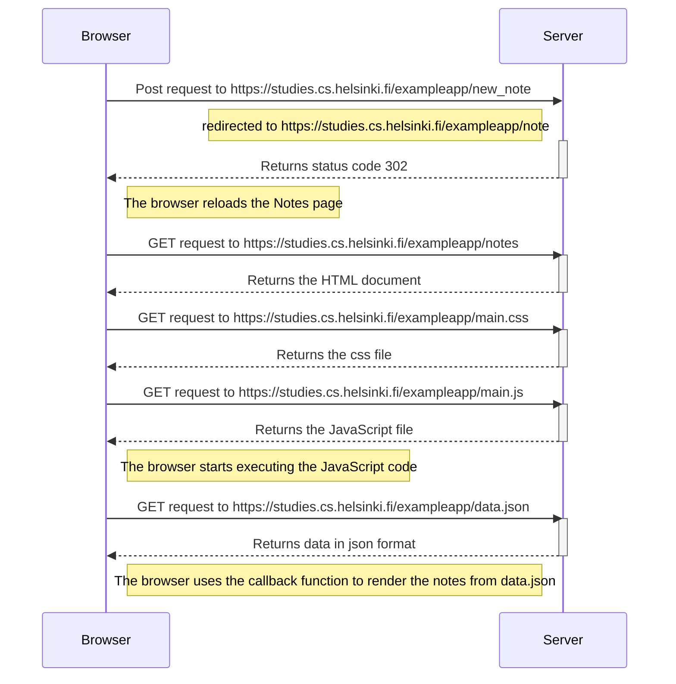

```mermaid
sequenceDiagram
    participant Browser
    participant Server

    Browser->>Server: Post request to https://studies.cs.helsinki.fi/exampleapp/new_note
    Note left of Server: redirected to https://studies.cs.helsinki.fi/exampleapp/note
    activate Server
    Server-->>Browser: Returns status code 302
    deactivate Server

    Note right of Browser: The browser reloads the Notes page

    Browser->>Server: GET request to https://studies.cs.helsinki.fi/exampleapp/notes
    activate Server
    Server-->>Browser: Returns the HTML document
    deactivate Server

    Browser->>Server: GET request to https://studies.cs.helsinki.fi/exampleapp/main.css
    activate Server
    Server-->>Browser: Returns the css file
    deactivate Server

    Browser->>Server: GET request to https://studies.cs.helsinki.fi/exampleapp/main.js
    activate Server
    Server-->>Browser: Returns the JavaScript file
    deactivate Server

    Note right of Browser: The browser starts executing the JavaScript code

    Browser->>Server: GET request to https://studies.cs.helsinki.fi/exampleapp/data.json
    activate Server
    Server-->>Browser: Returns data in json format
    deactivate Server

    Note right of Browser: The browser uses the callback function to render the notes from data.json
```
